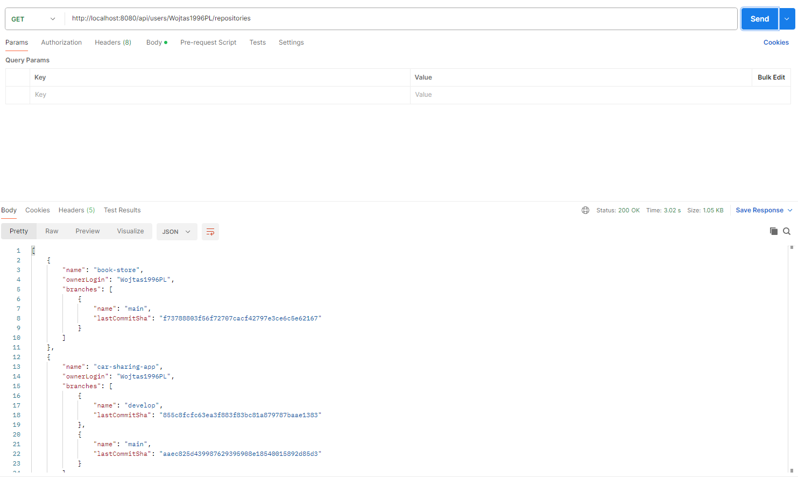

# GitHub Non-Fork Repository Scanner

This project is a Spring Boot application that fetches public repositories from GitHub for a given user and filters out the ones that are forks. For each non-fork repository, it returns its branches along with the latest commit SHA. To use this app, run the application and send @GetMapping request using program that can manage endpoints like Postman. By default, it should be http://localhost:8080/api/users/{username}/repositories. Replace {username} with GitHub username. You should receive a list of all repositories that are non forked. 

## ✅ Features

- Retrieves all public repositories of a given GitHub username
- Filters out forked repositories
- Fetches all branches for each non-forked repository
- Returns branch name and last commit SHA
- Exposes REST endpoint for requesting this data

## 🚀 Technologies Used

- Java 21
- Spring Boot
- RestTemplate (for consuming GitHub API)
- Lombok
- Maven

## 📦 API Endpoint

GET /api/users/{username}/repositories

### 🔸 Example Response:

```json
[
  {
    "name": "my-repo",
    "ownerLogin": "testuser",
    "branches": [
      {
        "name": "main",
        "lastCommitSha": "abc123"
      },
      {
        "name": "dev",
        "lastCommitSha": "def456"
      }
    ]
  }
]
```

This is screenshot from Postman, to give you an example of how it works:

